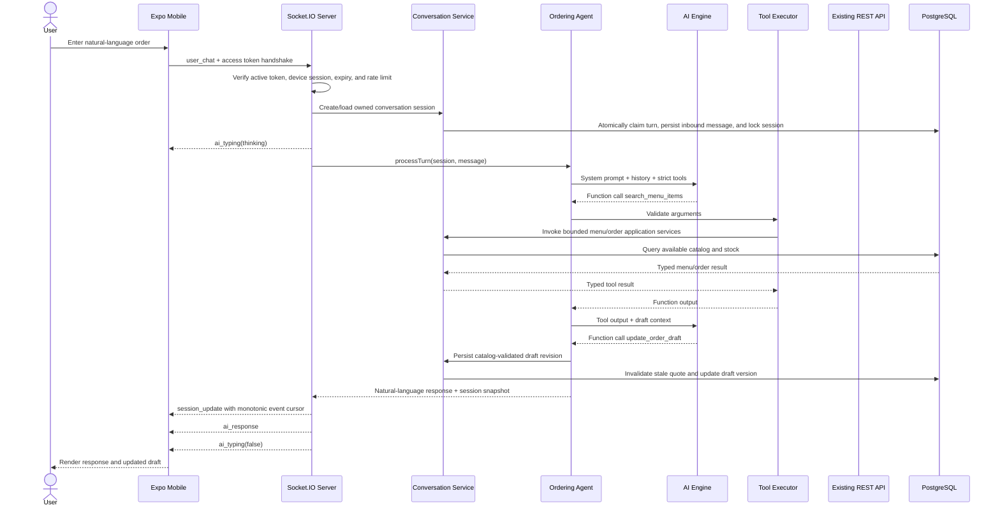
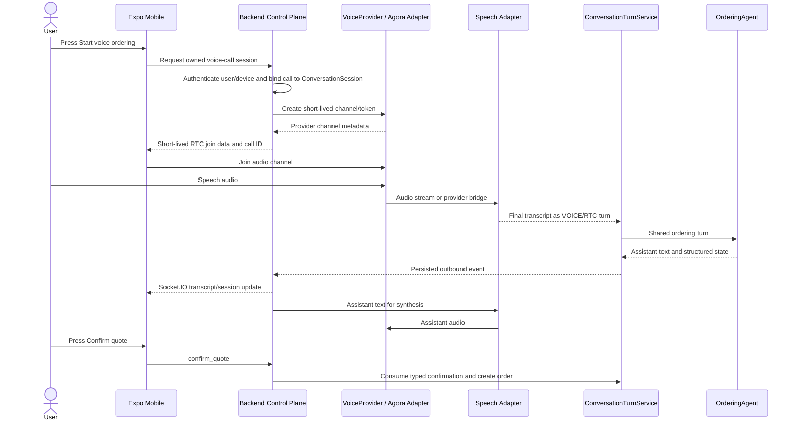

# AI Realtime Ordering Implementation Plan

> **For agentic workers:** REQUIRED SUB-SKILL: Use superpowers:subagent-driven-development (recommended) or superpowers:executing-plans to implement this plan task-by-task. Steps use checkbox (`- [ ]`) syntax for tracking.

**Goal:** Build an authenticated realtime ordering conversation in which the Expo mobile app sends natural-language requests over Socket.IO, a backend AI orchestrator maintains order-session memory, calls menu/order REST tools, and streams natural-language responses and session updates back to the user.

**Architecture:** Attach a typed Socket.IO server to the existing Node HTTP server and authenticate every connection with an active device session and access token. Keep AI credentials, model selection, prompt configuration, tool execution, session persistence, and OpenAI SDK usage exclusively in the backend. Persist serialized conversation turns, draft versions, quotes, confirmation actions, and outbound events in PostgreSQL; the AI tools use the same application services as the REST controllers rather than forwarding mobile bearer tokens through loopback HTTP. Keep the React Native screen limited to rendering hook state, durable outbox state, and typed user actions.

**Tech Stack:** Node.js 22, TypeScript strict mode, Socket.IO, OpenAI JavaScript SDK Responses API with function tools, Prisma/PostgreSQL, Vitest, React Native 0.81, Expo SDK 54, `socket.io-client`, Expo SecureStore.

**Future Voice Compatibility:** The ordering core is channel-agnostic. Text chat is the only implementation in this plan, but normalized conversation turns, session ownership, AI orchestration, draft/order state, confirmation actions, and tool policies must not depend on Socket.IO text payloads. A later voice phase may use Agora as the realtime media provider while reusing the same backend conversation and ordering services.

---

## Delivery Strategy and Priorities

### Hackathon MVP Delivery Boundary

For the Hackathon branch, implement only the smallest end-to-end slice that can be demonstrated reliably:

1. Fix backend LAN binding and unexpected `500` error handling.
2. Keep one authenticated KFC ordering conversation per logged-in mobile user.
3. Add Socket.IO `session_join`, `user_chat`, `ai_typing`, `ai_response`, `session_update`, and typed `confirm_quote`.
4. Persist conversation messages and one versioned draft in PostgreSQL.
5. Let the AI search menu items, update the draft, create a quote, and create one confirmed order through shared backend services.
6. Keep confirmation tokens backend-only and require the in-app confirm action.
7. Provide basic duplicate-message/order protection suitable for one backend process.
8. Restore the mobile auth session, reconnect the socket, and retry failed messages in memory during the demo session.
9. Verify backend tests/typecheck and Expo Android export.

The MVP explicitly defers Redis, multi-replica locks, distributed rate limits, durable process-restart event replay, full offline outbox persistence, history pagination, voice/Agora packages, recording, advanced cost dashboards, and production operations work. Preserve the interfaces and schema boundaries documented later so these features can be added without rewriting the ordering core, but do not block the demo on them.

1. **P0 — Contracts, security, and cost control:** configuration validation, authenticated socket handshake, token expiry/revocation, rate limits, redacted logs, event schemas, and atomic turn idempotency.
2. **P0 — Ordering core:** persisted conversation session, menu search, catalog-validated draft versions, quote invalidation, typed confirmation, stock-safe order creation, and cancellation stock restoration.
3. **P1 — Mobile realtime UX:** restored auth session, token refresh, durable outbox, reconnect/recovery, optimistic messages, connection state, typing stages, and fixed KFC bot entry.
4. **P1 — Reliability:** session turn serialization, outbound event replay, cursor-based history, tool timeout/error mapping, and integration tests.
5. **P2 — Scale-out:** Redis Socket.IO adapter, distributed locks/rate limits, multi-replica deployment, retention, and operations dashboards.
6. **Deferred voice phase:** authenticated RTC token issuance, voice-call lifecycle, speech/transcript adapters, interruption handling, call UX, and media-specific observability. No Agora/voice dependency is required for the text-chat release.

The first releasable vertical slice ends after Task 12: authenticated text chat can search the catalog, build a server-validated draft, create a quote, require typed user confirmation, create one idempotent order, survive reconnects, and display the result on mobile.

## Target File Structure

```text
src/backend/
├── .env.example
├── package.json
├── prisma/
│   ├── schema.prisma
│   └── migrations/20260711180000_add_conversation_draft_state/migration.sql
├── src/
│   ├── ai/
│   │   ├── ai-client.ts                 # Provider-neutral AI interface
│   │   ├── openai-ai-client.ts          # OpenAI Responses API adapter
│   │   ├── ordering-agent.ts            # Tool-call loop and final response
│   │   ├── ordering-prompt.ts           # KFC system prompt
│   │   ├── ordering-tools.ts            # Strict function definitions
│   │   └── tool-executor.ts             # REST tool dispatch and validation
│   ├── config/
│   │   ├── ai-config.ts                 # AI env parsing and validation
│   │   └── auth-config.ts
│   ├── conversations/
│   │   ├── conversation-repository.ts   # Session/message persistence contract
│   │   ├── prisma-conversation-repository.ts
│   │   └── conversation-service.ts      # Session ownership and draft state
│   ├── turns/
│   │   ├── conversation-turn-service.ts # Atomic turn claim, lease, and replay
│   │   └── prisma-turn-repository.ts
│   ├── conversation-core/
│   │   ├── conversation-input.ts        # Normalized TEXT/VOICE turn input
│   │   └── conversation-output.ts       # Channel-neutral assistant output
│   ├── menu-items/
│   │   └── menu-item-service.ts         # Existing lookup plus catalog search
│   ├── realtime/
│   │   ├── chat-events.ts               # Shared server event types
│   │   ├── chat-handler.ts              # Per-message orchestration
│   │   ├── socket-auth.ts                # Handshake token validation
│   │   └── socket-server.ts              # Socket.IO lifecycle and listeners
│   ├── tools/
│   │   └── ordering-service-gateway.ts   # Bounded application-service adapter
│   ├── http/app.ts
│   └── server.ts
└── tests/
    ├── ai/
    │   ├── ordering-agent.test.ts
    │   └── tool-executor.test.ts
    ├── config/ai-config.test.ts
    ├── conversations/conversation-service.test.ts
    ├── menu-items/menu-item-api.test.ts
    └── realtime/
        ├── chat-handler.test.ts
        └── socket-server.test.ts

src/frontend-mobile/
├── .env.example
├── package.json
├── App.tsx
├── chatData.ts
├── theme.ts
├── models/
│   └── chat.ts                          # Mobile message/event types
├── services/
│   ├── authService.ts
│   └── socketService.ts                 # Socket construction only
├── hooks/
│   └── useChatSocket.ts                 # Connection and chat state lifecycle
├── storage/
│   └── chatOutboxStore.ts                # Durable draft, outbox, and session ID
├── components/
│   ├── ChatInputBar.tsx
│   ├── ChatTypingIndicator.tsx
│   ├── ConnectionBanner.tsx
│   └── MessageBubble.tsx
└── pages/
    ├── MessengerChatList.tsx
    ├── MessengerChatModule.tsx
    └── ChatConversationDetail.tsx

future voice phase/
├── src/backend/src/voice/
│   ├── voice-provider.ts                 # Provider-neutral RTC contract
│   ├── agora-voice-provider.ts           # Agora token/channel adapter
│   ├── voice-call-service.ts             # Call lifecycle and session binding
│   ├── speech-adapter.ts                 # ASR/TTS or realtime voice bridge
│   └── voice-events.ts                   # Call control/transcript events
└── src/frontend-mobile/
    ├── hooks/useVoiceCall.ts
    ├── services/voiceCallService.ts
    ├── components/VoiceCallControls.tsx
    └── pages/VoiceOrderingCall.tsx
```

## Part 1 — Data Flow and Environment Security

### Channel-Neutral Core Boundary

The text implementation must normalize Socket.IO input before invoking ordering logic:

```ts
export type ConversationModality = "TEXT" | "VOICE";

export interface ConversationTurnInput {
  sessionId: string;
  userId: string;
  deviceId: string;
  clientTurnId: string;
  modality: ConversationModality;
  text: string;
  occurredAt: Date;
  source: {
    transport: "SOCKET_IO" | "RTC";
    providerCallId?: string;
    providerSequence?: number;
  };
}

export interface ConversationTurnOutput {
  assistantText: string;
  businessState: BusinessState;
  draft: DraftSnapshot;
  confirmationRequired: boolean;
}
```

For the current release, `ChatHandler` maps `user_chat` to `modality: "TEXT"` and `transport: "SOCKET_IO"`. A future voice adapter maps final user transcripts to `modality: "VOICE"` and `transport: "RTC"`, then invokes the same `ConversationTurnService` and `OrderingAgent`. The AI agent and ordering services never import Socket.IO or Agora types.

### Media Plane vs Control Plane

- **Media plane:** a future RTC provider transports microphone audio and synthesized assistant audio. Agora is one candidate adapter, isolated behind `VoiceProvider`.
- **Control plane:** authenticated backend APIs and Socket.IO events manage call creation, session ownership, call state, transcript synchronization, quote display, typed confirmation, order completion, and error recovery.
- **Ordering plane:** `ConversationTurnService`, `OrderingAgent`, draft versioning, quote creation, typed confirmation, order creation, cancellation, and stock logic are shared by text and voice.
- Raw audio is not required by the order domain. The shared core consumes final transcripts and returns assistant text plus structured state. Provider-specific audio IDs remain metadata, not business identifiers.
- Text and voice for the same authenticated user may bind to the same `ConversationSession`; the per-session turn lease prevents a text message and voice transcript from mutating the draft concurrently.

### Sequence Diagram



### Security Decisions

- The mobile app receives only `EXPO_PUBLIC_API_BASE_URL` and `EXPO_PUBLIC_SOCKET_URL`; both are public network locations, never secrets.
- `AI_API_KEY`, `AI_MODEL_NAME`, prompt version, tool timeout, and service configuration are backend-only variables loaded before the server starts. Neither an AI key nor an internal service URL is accepted from socket payloads or mobile environment variables.
- Socket authentication reuses the current access token from Expo SecureStore. The token is sent in `socket.auth.accessToken`, not in query parameters or logged URLs.
- Every authenticated mobile session is created with a non-null owner, and every repository method accepts a principal and queries by `{ id, userId }`; clients cannot join or write to another user's session.
- AI prompts receive redacted conversation text and minimum necessary user/order data. Authentication secrets, refresh tokens, password hashes, and full environment values never enter prompts or logs.
- Order creation requires an explicit `confirm_quote` UI action after a quote is generated. The backend persists and atomically consumes that confirmation action; the model never interprets a free-text confirmation and never receives the confirmation capability token.
- This confirmation rule is identical for future voice calls: a spoken phrase such as “yes” may let the assistant explain that the quote is ready, but only the authenticated app confirmation control can emit `confirm_quote` and create an order.
- A unique `ConversationTurn` lease serializes all turns in one session. Duplicates replay persisted acknowledgement/outbound events instead of rerunning the AI or tools.
- Tool calls are allow-listed, schema-validated, and capability-validated against the current database state. The model never chooses arbitrary URLs, HTTP methods, database queries, headers, owned IDs, draft versions, confirmation actions, or idempotency keys.
- Handshake and per-turn limits for IP, user, device, session, payload size, active turns, tool calls, and model spend are P0 requirements. Logs contain correlation IDs, safe error codes, and timings only; prompts, completions, credentials, tokens, addresses, and phone numbers are redacted.
- A future voice provider token is generated only by the backend after authenticating the current user/device and binding it to an owned `ConversationSession` and short-lived call ID. Provider app certificates, AI keys, refresh tokens, and raw audio access credentials never reach the mobile app.

## Part 2 — Socket Event Specification

### Client-to-Server Events

#### `session_join`

```json
{
  "protocol_version": 1,
  "session_id": "optional-existing-session-uuid"
}
```

Acknowledgement:

```json
{
  "ok": true,
  "session_id": "conversation-session-uuid",
  "history": [
    {
      "id": "message-uuid",
      "client_message_id": null,
      "text": "Welcome to KFC. What would you like to order?",
      "sender": "bot",
      "timestamp": "2026-07-11T14:00:00.000Z",
      "status": "seen"
    }
  ]
}
```

#### `user_chat`

```json
{
  "protocol_version": 1,
  "session_id": "conversation-session-uuid",
  "client_message_id": "mobile-generated-uuid",
  "text": "Cho mình 1 combo gà rán 2 miếng và 1 Pepsi ít đá",
  "sent_at": "2026-07-11T14:01:00.000Z"
}
```

#### `confirm_quote`

The confirmation action is emitted only after the UI renders a server-provided quote summary and the user presses a dedicated confirmation control. It is not inferred from natural-language text.

```json
{
  "protocol_version": 1,
  "session_id": "conversation-session-uuid",
  "quote_id": "quote-uuid",
  "client_action_id": "mobile-generated-uuid"
}
```

Acknowledgement:

```json
{
  "ok": true,
  "session_id": "conversation-session-uuid",
  "quote_id": "quote-uuid",
  "confirmation_action_id": "confirmation-action-uuid",
  "accepted_at": "2026-07-11T14:03:00.100Z"
}
```

Acknowledgement:

```json
{
  "ok": true,
  "session_id": "conversation-session-uuid",
  "message_id": "persisted-message-uuid",
  "client_message_id": "mobile-generated-uuid",
  "accepted_at": "2026-07-11T14:01:00.100Z"
}
```

Failed acknowledgement:

```json
{
  "ok": false,
  "client_message_id": "mobile-generated-uuid",
  "error": {
    "code": "INVALID_MESSAGE",
    "message": "Message text must contain between 1 and 2000 characters.",
    "retryable": false
  }
}
```

### Server-to-Client Events

#### `ai_typing`

```json
{
  "session_id": "conversation-session-uuid",
  "is_typing": true,
  "stage": "checking_menu"
}
```

Allowed stages: `thinking`, `checking_menu`, `updating_draft`, `building_quote`, `creating_order`.

#### `ai_response`

```json
{
  "session_id": "conversation-session-uuid",
  "message": {
    "id": "assistant-message-uuid",
    "client_message_id": null,
    "text": "Mình đã thêm 1 combo gà 2 miếng và 1 Pepsi. Bạn muốn dùng Pepsi cỡ vừa hay lớn?",
    "sender": "bot",
    "timestamp": "2026-07-11T14:01:02.000Z",
    "status": "sent"
  }
}
```

#### `session_update`

```json
{
  "session_id": "conversation-session-uuid",
  "event_cursor": 42,
  "business_state": "CART_ACTIVE",
  "draft": {
    "items": [
      {
        "menu_item_id": "menu-item-uuid",
        "name": "Combo gà rán 2 miếng",
        "quantity": 1,
        "modifier_option_ids": []
      }
    ],
    "missing_fields": ["drink_size", "delivery_address"],
    "draft_version": 3,
    "quote": null,
    "order_id": null
  },
  "updated_at": "2026-07-11T14:01:02.000Z"
}
```

When a quote exists, the public snapshot contains only safe display data:

```json
{
  "quote": {
    "id": "quote-uuid",
    "subtotal": 159000,
    "delivery_fee": 15000,
    "total": 174000,
    "currency": "VND",
    "expires_at": "2026-07-11T14:20:00.000Z",
    "requires_confirmation": true
  }
}
```

The confirmation token remains server-only and is never present in `session_update`, `ai_response`, logs, mobile storage, or model context.

#### `chat_error`

```json
{
  "session_id": "conversation-session-uuid",
  "event_cursor": 43,
  "client_message_id": "mobile-generated-uuid",
  "error": {
    "code": "AI_TEMPORARILY_UNAVAILABLE",
    "message": "The ordering assistant is temporarily unavailable. Please try again.",
    "retryable": true
  }
}
```

#### `connection_state`

```json
{
  "state": "connected",
  "server_time": "2026-07-11T14:01:00.000Z"
}
```

Allowed states: `connected`, `reconnecting`, `unauthorized`, `maintenance`.

#### `session_history`

The server returns bounded history in the `session_join` acknowledgement and exposes cursor-based pagination for older messages. Every `ai_response`, `session_update`, and `chat_error` includes an increasing `event_cursor`; reconnecting clients provide their last cursor so the server can replay committed outbound events without losing a response after a process or network interruption.

## Part 3 — Frontend Mobile UX Rules

- Insert the user message immediately with status `sending`, atomically clear the composer, and store it in a durable FIFO outbox keyed by `client_message_id`.
- Change it to `sent` only after the `user_chat` acknowledgement returns `ok: true`. Preserve the same ID on every retry.
- Queue sends while disconnected and flush the outbox only after a successful `session_join`; use bounded exponential backoff and expose manual retry after the final failed attempt.
- Display `ChatTypingIndicator` while `ai_typing.is_typing` is true. Map stages to English labels: `thinking` → “KFC Bot is thinking…”, `checking_menu` → “Checking today’s menu…”, `building_quote` → “Calculating your order…”, `creating_order` → “Confirming your order…”.
- Disable the send button only while the composer is empty or while its synchronous enqueue operation is executing; pending acknowledgements are tracked per message.
- Show `ConnectionBanner` above the input when disconnected or reconnecting. The banner must not promise automatic recovery unless the durable outbox has been restored and scheduled for flush.
- Keep the hook state reverse chronological: index `0` is always the newest message. Reverse chronological server history once at join time, prepend new messages, and never reverse message data during render.
- Register socket listeners before connecting; merge join history by server `id` and then `client_message_id`, ignore other sessions, retain pending outbox messages, and use `event_cursor` to replay missed server events.
- On background, pause socket work and clear typing state. On foreground/network recovery, refresh the access token if needed, reconnect, join the persisted session, merge/replay history, and flush the outbox.
- Keep all colors, dimensions, spacing, typography, and animation durations in `theme.ts`.

## Part 4 — Backend AI and Tool Rules

### System Prompt Responsibilities

The prompt must instruct the assistant to:

1. Act as a concise, friendly KFC ordering employee.
2. Reply in the user's language unless explicitly asked to switch.
3. Never invent item IDs, prices, availability, discounts, stock, quote totals, delivery fees, or order status.
4. Use `search_menu_items` before referring to catalog details not already present in the session.
5. Use `update_order_draft` after the user adds, removes, or changes an item.
6. Ask one focused clarification question when required modifiers, quantity, or delivery fields are missing.
7. Use `create_order_quote` only when the draft has valid items and complete delivery information.
8. Present the quote total and request explicit confirmation.
9. Never infer confirmation from text. After the server receives `confirm_quote`, use `create_order` only with the server-derived quote and confirmation action capability.
10. Treat tool output as authoritative and convert tool errors into actionable natural-language guidance.

### Tool Set

- `search_menu_items({ query, limit })`
- `get_menu_items({ ids })`
- `update_order_draft({ items, delivery, voucher_code })`
- `create_order_quote({ session_id })`
- `create_order({ session_id })`
- `get_order({ order_id })`
- `cancel_order({ order_id, reason })`

`update_order_draft` is an orchestrator-owned tool and does not call a public transport. It validates catalog IDs and modifiers through a bounded application-service adapter before persisting a new draft version. Catalog and order operations use the same application services as REST controllers, with the same request/response DTO rules but without forwarding a mobile bearer token.

---

### Task 1: Install Realtime, AI, Mobile Persistence, and Test Dependencies

**Files:**
- Modify: `src/backend/package.json`
- Modify: `src/backend/package-lock.json`
- Modify: `src/frontend-mobile/package.json`
- Modify: `src/frontend-mobile/package-lock.json`

- [ ] **Step 1: Install backend runtime dependencies**

Run:

```bash
npm --prefix src/backend install socket.io openai
```

Expected: `socket.io` and `openai` appear under `dependencies` and npm exits with code `0`.

- [ ] **Step 2: Install backend test client**

Run:

```bash
npm --prefix src/backend install --save-dev socket.io-client
```

Expected: `socket.io-client` appears under backend `devDependencies`.

- [ ] **Step 3: Install the Expo Socket.IO client**

Run:

```bash
npm --prefix src/frontend-mobile install socket.io-client
```

Expected: `socket.io-client` appears under mobile `dependencies`.

- [ ] **Step 4: Install mobile durable-storage and test dependencies**

Run:

```bash
npm --prefix src/frontend-mobile exec expo install expo-crypto @react-native-async-storage/async-storage jest-expo
npm --prefix src/frontend-mobile install --save-dev @testing-library/react-native
```

Expected: the mobile module has `expo-crypto`, AsyncStorage, Jest Expo, and React Native Testing Library available for UUID creation, durable outbox/session storage, and hook/component tests.

Add the mobile test script and Jest preset to `src/frontend-mobile/package.json`:

```json
{
  "scripts": {
    "test": "jest --runInBand"
  },
  "jest": {
    "preset": "jest-expo"
  }
}
```

- [ ] **Step 5: Verify dependency trees**

Run:

```bash
npm --prefix src/backend ls socket.io openai socket.io-client
npm --prefix src/frontend-mobile ls socket.io-client expo-crypto @react-native-async-storage/async-storage jest-expo @testing-library/react-native
```

Expected: all requested packages resolve without `UNMET DEPENDENCY`.

- [ ] **Step 6: Commit dependency changes**

```bash
git add src/backend/package.json src/backend/package-lock.json src/frontend-mobile/package.json src/frontend-mobile/package-lock.json
git commit -m "build: add realtime ordering dependencies"
```

### Task 2: Add and Validate Backend AI Configuration

**Files:**
- Create: `src/backend/src/config/ai-config.ts`
- Create: `src/backend/tests/config/ai-config.test.ts`
- Modify: `src/backend/.env.example`

- [ ] **Step 1: Write failing configuration tests**

Create `src/backend/tests/config/ai-config.test.ts`:

```ts
import { describe, expect, it } from "vitest";
import { loadAiConfig } from "../../src/config/ai-config.js";

describe("loadAiConfig", () => {
  it("loads a complete backend-only AI configuration", () => {
    expect(loadAiConfig({
      AI_API_KEY: "test-api-key",
      AI_MODEL_NAME: "gpt-4o",
      AI_MAX_TOOL_ROUNDS: "6",
      AI_REQUEST_TIMEOUT_MS: "30000",
      SOCKET_MAX_MESSAGES_PER_MINUTE: "20",
      SOCKET_MAX_CONCURRENT_TURNS: "1",
      AI_DAILY_USER_BUDGET_CENTS: "500",
    })).toEqual({
      apiKey: "test-api-key",
      modelName: "gpt-4o",
      maxToolRounds: 6,
      requestTimeoutMs: 30000,
      maxMessagesPerMinute: 20,
      maxConcurrentTurns: 1,
      dailyUserBudgetCents: 500,
    });
  });

  it("rejects a missing API key", () => {
    expect(() => loadAiConfig({ AI_MODEL_NAME: "gpt-4o" })).toThrow("AI_API_KEY is required");
  });

  it("rejects invalid positive integer settings", () => {
    expect(() => loadAiConfig({ AI_API_KEY: "key", AI_MODEL_NAME: "gpt-4o", AI_MAX_TOOL_ROUNDS: "0" })).toThrow("AI_MAX_TOOL_ROUNDS");
  });
});
```

- [ ] **Step 2: Run the test and verify failure**

Run:

```bash
npm --prefix src/backend test -- tests/config/ai-config.test.ts
```

Expected: FAIL because `ai-config.ts` does not exist.

- [ ] **Step 3: Implement strict configuration parsing**

Create `src/backend/src/config/ai-config.ts`:

```ts
export interface AiConfig {
  apiKey: string;
  modelName: string;
  maxToolRounds: number;
  requestTimeoutMs: number;
  maxMessagesPerMinute: number;
  maxConcurrentTurns: number;
  dailyUserBudgetCents: number;
}

export function loadAiConfig(environment: NodeJS.ProcessEnv = process.env): AiConfig {
  return {
    apiKey: required(environment, "AI_API_KEY"),
    modelName: required(environment, "AI_MODEL_NAME"),
    maxToolRounds: positiveInteger(environment, "AI_MAX_TOOL_ROUNDS", 6),
    requestTimeoutMs: positiveInteger(environment, "AI_REQUEST_TIMEOUT_MS", 30_000),
    maxMessagesPerMinute: boundedInteger(environment, "SOCKET_MAX_MESSAGES_PER_MINUTE", 20, 1, 120),
    maxConcurrentTurns: boundedInteger(environment, "SOCKET_MAX_CONCURRENT_TURNS", 1, 1, 2),
    dailyUserBudgetCents: boundedInteger(environment, "AI_DAILY_USER_BUDGET_CENTS", 500, 1, 100_000),
  };
}

function required(environment: NodeJS.ProcessEnv, name: string): string {
  const value = environment[name]?.trim();
  if (!value) throw new Error(`${name} is required.`);
  return value;
}

function positiveInteger(environment: NodeJS.ProcessEnv, name: string, fallback: number): number {
  const value = Number(environment[name] ?? fallback);
  if (!Number.isInteger(value) || value <= 0) throw new Error(`${name} must be a positive integer.`);
  return value;
}

function boundedInteger(environment: NodeJS.ProcessEnv, name: string, fallback: number, minimum: number, maximum: number): number {
  const value = positiveInteger(environment, name, fallback);
  if (value < minimum || value > maximum) throw new Error(`${name} must be between ${minimum} and ${maximum}.`);
  return value;
}
```

- [ ] **Step 4: Extend the backend environment template**

Append to `src/backend/.env.example`:

```dotenv
AI_API_KEY=replace-with-a-server-side-api-key
AI_MODEL_NAME=gpt-4o
AI_MAX_TOOL_ROUNDS=6
AI_REQUEST_TIMEOUT_MS=30000
SOCKET_ALLOWED_ORIGINS=http://localhost:8081
SOCKET_MAX_MESSAGES_PER_MINUTE=20
SOCKET_MAX_CONCURRENT_TURNS=1
AI_DAILY_USER_BUDGET_CENTS=500
```

Do not add any `AI_*` key to `src/frontend-mobile/.env.example`.

- [ ] **Step 5: Run tests and lint**

```bash
npm --prefix src/backend test -- tests/config/ai-config.test.ts
npm --prefix src/backend run lint
```

Expected: configuration tests PASS and lint exits `0`.

- [ ] **Step 6: Commit configuration changes**

```bash
git add src/backend/.env.example src/backend/src/config/ai-config.ts src/backend/tests/config/ai-config.test.ts
git commit -m "feat: validate AI orchestrator configuration"
```

### Task 3: Define Strict Realtime Contracts

**Files:**
- Create: `src/backend/src/realtime/chat-events.ts`
- Create: `src/frontend-mobile/models/chat.ts`
- Modify: `src/frontend-mobile/chatData.ts`

- [ ] **Step 1: Add backend event contracts**

Create `src/backend/src/realtime/chat-events.ts` with explicit event maps:

```ts
export type TypingStage = "thinking" | "checking_menu" | "updating_draft" | "building_quote" | "creating_order";
export type BusinessState = "BROWSING" | "CART_ACTIVE" | "READY_TO_QUOTE" | "AWAITING_CONFIRMATION" | "ORDER_CREATED" | "ORDER_CANCELLED" | "HANDOFF";

export interface ChatMessageDto {
  id: string;
  client_message_id: string | null;
  text: string;
  sender: "user" | "bot";
  timestamp: string;
  status: "sending" | "sent" | "seen" | "failed";
}

export interface UserChatPayload {
  protocol_version: 1;
  session_id: string;
  client_message_id: string;
  text: string;
  sent_at: string;
}

export type UserChatAck =
  | { ok: true; session_id: string; message_id: string; client_message_id: string; accepted_at: string }
  | { ok: false; client_message_id: string; error: ChatErrorDto };

export interface DraftSnapshot {
  items: Array<{ menu_item_id: string; name: string; quantity: number; modifier_option_ids: string[] }>;
  delivery?: { email: string; recipient_name: string; phone: string; address_line: string; ward?: string; district?: string; city: string };
  missing_fields: string[];
  draft_version: number;
  quote: { id: string; subtotal: number; delivery_fee: number; total: number; currency: string; expires_at: string; requires_confirmation: true } | null;
  order_id: string | null;
}

export interface ConfirmQuotePayload {
  protocol_version: 1;
  session_id: string;
  quote_id: string;
  client_action_id: string;
}

export interface ChatErrorDto {
  code: string;
  message: string;
  retryable: boolean;
}

export interface ClientToServerEvents {
  session_join: (payload: { protocol_version: 1; session_id?: string; last_event_cursor?: number }, acknowledge: (result: { ok: true; session_id: string; history: ChatMessageDto[]; latest_event_cursor: number } | { ok: false; error: ChatErrorDto }) => void) => void;
  user_chat: (payload: UserChatPayload, acknowledge: (result: UserChatAck) => void) => void;
  confirm_quote: (payload: ConfirmQuotePayload, acknowledge: (result: { ok: true; session_id: string; quote_id: string; confirmation_action_id: string; accepted_at: string } | { ok: false; error: ChatErrorDto }) => void) => void;
}

export interface ServerToClientEvents {
  ai_typing: (payload: { session_id: string; is_typing: boolean; stage: TypingStage }) => void;
  ai_response: (payload: { session_id: string; event_cursor: number; message: ChatMessageDto }) => void;
  session_update: (payload: { session_id: string; event_cursor: number; business_state: BusinessState; draft: DraftSnapshot; updated_at: string }) => void;
  chat_error: (payload: { session_id: string; event_cursor: number; client_message_id: string | null; error: ChatErrorDto }) => void;
  connection_state: (payload: { state: "connected" | "reconnecting" | "unauthorized" | "maintenance"; server_time: string }) => void;
}
```

- [ ] **Step 2: Mirror transport DTOs in mobile models**

Create `src/frontend-mobile/models/chat.ts` using the same field names and unions. Add mobile-only `ChatConnectionState = 'connecting' | 'connected' | 'reconnecting' | 'disconnected' | 'unauthorized'` and `ChatMessageStatus = 'sending' | 'sent' | 'seen' | 'failed'`.

- [ ] **Step 3: Move message types out of mock data**

Modify `src/frontend-mobile/chatData.ts` to import `ChatMessageDto` or its UI-mapped equivalent from `models/chat.ts`. Keep only mock fixtures and `ChatMessage` list-row data in this file.

- [ ] **Step 4: Pin the KFC bot fixture at index zero**

Define `KFC_BOT_CHAT_ID = 'kfc-ordering-bot'`, set the display name to `KFC Ordering Bot`, and construct the exported list as:

```ts
export const chatData: ChatMessage[] = [kfcOrderingBotChat, ...otherChats];
```

- [ ] **Step 5: Run mobile typecheck**

```bash
npm --prefix src/frontend-mobile run typecheck
```

Expected: PASS with no implicit `any` and no stale imports from `chatData.ts`.

- [ ] **Step 6: Commit shared contracts**

```bash
git add src/backend/src/realtime/chat-events.ts src/frontend-mobile/models/chat.ts src/frontend-mobile/chatData.ts
git commit -m "feat: define realtime chat contracts"
```

### Task 4: Persist Conversation Draft State and Messages

**Files:**
- Modify: `src/backend/prisma/schema.prisma`
- Create: `src/backend/prisma/migrations/20260711180000_add_conversation_draft_state/migration.sql`
- Create: `src/backend/src/conversations/conversation-repository.ts`
- Create: `src/backend/src/conversations/prisma-conversation-repository.ts`
- Create: `src/backend/src/conversations/conversation-service.ts`
- Create: `src/backend/src/turns/conversation-turn-service.ts`
- Create: `src/backend/src/turns/prisma-turn-repository.ts`
- Create: `src/backend/tests/conversations/conversation-service.test.ts`

- [ ] **Step 1: Write failing ownership and idempotency tests**

Create tests proving that `ConversationService`:

```ts
it("creates one mobile session for an authenticated owner", async () => {
  const session = await service.join({ userId: "user-1", requestedSessionId: undefined });
  expect(session.userId).toBe("user-1");
  expect(session.channel).toBe("MESSENGER");
});

it("rejects joining another user's session", async () => {
  await expect(service.join({ userId: "user-2", requestedSessionId: "session-user-1" })).rejects.toMatchObject({ code: "SESSION_FORBIDDEN" });
});

it("deduplicates inbound messages by client message id", async () => {
  const first = await service.appendUserMessage({ sessionId: "session-1", userId: "user-1", clientMessageId: "client-1", text: "One Pepsi" });
  const second = await service.appendUserMessage({ sessionId: "session-1", userId: "user-1", clientMessageId: "client-1", text: "One Pepsi" });
  expect(second.id).toBe(first.id);
});
```

- [ ] **Step 2: Run the tests and verify failure**

```bash
npm --prefix src/backend test -- tests/conversations/conversation-service.test.ts
```

Expected: FAIL because the conversation service does not exist.

- [ ] **Step 3: Add draft JSON to the Prisma session**

Add to `ConversationSession`:

```prisma
draftState Json @default("{}") @map("draft_state")
draftVersion Int @default(0) @map("draft_version")
eventCursor BigInt @default(0) @map("event_cursor")
```

Add `ConversationTurn` and `ConversationConfirmation` models. `ConversationTurn` has a unique composite key of `sessionId` and `clientMessageId`, a request hash, `PROCESSING|COMPLETED|FAILED` status, lease expiry, and persisted response/event cursor. `ConversationConfirmation` has a unique `clientActionId`, owned quote ID, consumed timestamp, and a relation to its session.

Include modality metadata on `ConversationTurn` now: `modality` defaults to `TEXT`, `transport` defaults to `SOCKET_IO`, and `providerCallId` is nullable. The text release writes only the defaults; this prevents a future voice call from requiring a second turn-storage design or a separate ordering session.

Create the migration with:

```sql
ALTER TABLE "conversation_sessions"
ADD COLUMN "draft_state" JSONB NOT NULL DEFAULT '{}'::jsonb;
ALTER TABLE "conversation_sessions"
ADD COLUMN "draft_version" INTEGER NOT NULL DEFAULT 0,
ADD COLUMN "event_cursor" BIGINT NOT NULL DEFAULT 0;
```

- [ ] **Step 4: Define a repository contract**

`conversation-repository.ts` must expose only session operations needed by the orchestrator: `createSession`, `findOwnedSession`, `findMessageByExternalId`, `appendMessage`, `listMessages`, `updateDraft`, and `updateProviderConversationId`.

- [ ] **Step 5: Implement the Prisma repository**

Map inbound messages to `direction: INBOUND`, `role: USER`; assistant messages to `OUTBOUND`/`ASSISTANT`; function results to `INTERNAL`/`TOOL`. Store the mobile `client_message_id` in `externalMessageId` so the existing unique constraint enforces idempotency.

- [ ] **Step 6: Implement the conversation service**

Validate ownership before every read/write, trim message text, enforce `1..2000` characters, and return the existing message when `externalMessageId` has already been stored. Every material draft change increments `draftVersion`, invalidates any active quote for the prior draft, clears server-only confirmation capabilities, and transitions the session back to an editable state.

- [ ] **Step 7: Implement turn claiming and confirmation persistence**

`ConversationTurnService.claim()` must use a transaction to create or return the existing turn, acquire a per-session PostgreSQL advisory lock or serializable lease, and return one of `claimed`, `processing`, or `completed`. Persist outbound events before emitting them. `ConversationService.confirmQuote()` must verify session ownership, active quote, matching draft version, and one-time `clientActionId`, then persist an unconsumed confirmation action; it never returns a confirmation token to mobile.

`ConversationTurnService` accepts `ConversationTurnInput`, not a Socket.IO payload. Its tests must include one `TEXT/SOCKET_IO` turn now and define a fixture shape for future `VOICE/RTC` input without adding a voice runtime dependency.

- [ ] **Step 8: Generate Prisma Client and run tests**

```bash
npm --prefix src/backend run db:generate
npm --prefix src/backend test -- tests/conversations/conversation-service.test.ts
npm --prefix src/backend run lint
```

Expected: tests PASS and schema validation succeeds.

- [ ] **Step 9: Commit persistence changes**

```bash
git add src/backend/prisma src/backend/src/conversations src/backend/tests/conversations
git commit -m "feat: persist realtime conversation state"
```

### Task 5: Add Natural-Language Menu Search REST Contract

**Files:**
- Modify: `src/backend/src/menu-items/menu-item-service.ts`
- Modify: `src/backend/src/http/app.ts`
- Modify: `src/backend/tests/menu-items/menu-item-api.test.ts`

- [ ] **Step 1: Write a failing search API test**

Add a test for:

```http
GET /api/menu-items/search?q=zinger%20combo&limit=10
Authorization: Bearer <access-token>
```

Expected JSON:

```json
{
  "items": [
    {
      "id": "menu-item-uuid",
      "name": "Zinger Combo",
      "description": "Zinger burger, fries and Pepsi",
      "price": 89000,
      "currency": "VND",
      "stock_quantity": 12,
      "modifier_groups": []
    }
  ]
}
```

Assert that unavailable or zero-stock items are excluded and `limit` is bounded to `1..20`.

- [ ] **Step 2: Run the focused test and verify failure**

```bash
npm --prefix src/backend test -- tests/menu-items/menu-item-api.test.ts
```

Expected: FAIL with route `404` or missing service method.

- [ ] **Step 3: Implement `search(query, limit)`**

Use Prisma case-insensitive matching against `name`, `description`, and `externalId`, with `isAvailable: true` and `stockQuantity: { gt: 0 }`. Include only available modifier options and preserve display ordering.

- [ ] **Step 4: Add the REST route before the ID lookup route**

In `src/backend/src/http/app.ts`, route `/api/menu-items/search` before `/api/menu-items`, validate a non-empty query up to 120 characters, parse the bounded limit, and reuse the authenticated principal requirement.

- [ ] **Step 5: Run focused and full backend tests**

```bash
npm --prefix src/backend test -- tests/menu-items/menu-item-api.test.ts
npm --prefix src/backend run test
```

Expected: all menu tests and the full suite PASS.

- [ ] **Step 6: Enforce modifier and quantity rules in quote creation**

Add failing order-service tests for required modifier groups, `minChoices`, `maxChoices`, duplicate options, options belonging to another group/item, unavailable options, and requested quantity greater than current stock. Implement authoritative validation in `OrderService.createQuote`; AI clarification improves UX but never replaces these checks. Define quotes as non-reserving: quote creation performs an advisory stock check, while order creation retains the atomic decrement. On `INSUFFICIENT_STOCK`, invalidate the quote and return the session draft to an editable state.

- [ ] **Step 7: Commit menu and quote validation**

```bash
git add src/backend/src/menu-items/menu-item-service.ts src/backend/src/orders/order-service.ts src/backend/src/http/app.ts src/backend/tests/menu-items/menu-item-api.test.ts src/backend/tests/orders
git commit -m "feat: validate searchable menu ordering rules"
```

### Task 6: Build the Server-Authoritative Ordering Tool Gateway

**Files:**
- Create: `src/backend/src/tools/ordering-service-gateway.ts`
- Create: `src/backend/tests/ai/tool-executor.test.ts`
- Create: `src/backend/src/ai/ordering-tools.ts`
- Create: `src/backend/src/ai/tool-executor.ts`

- [ ] **Step 1: Write failing tool validation tests**

Cover `search_menu_items`, `get_menu_items`, `update_order_draft`, `create_order_quote`, `create_order`, `get_order`, and `cancel_order`. Assert that unknown tools, missing fields, invented catalog IDs, invalid draft versions, unconfirmed quotes, quantities below one, and model-supplied ownership/idempotency values are rejected before a domain service call occurs.

- [ ] **Step 2: Define strict tool schemas**

In `ordering-tools.ts`, export OpenAI function definitions with `strict: true`, `additionalProperties: false`, bounded arrays, and required fields. Keep `update_order_draft` as an orchestrator-local tool.

- [ ] **Step 3: Implement the bounded application-service gateway**

`OrderingServiceGateway` receives the authenticated principal, session ID, draft version, and injected `MenuItemService`, `ConversationService`, and `OrderService`. It derives owned IDs, active quote, confirmation action, and idempotency key from persisted state. It never accepts a URL, access token, user ID, confirmation token, or idempotency key from the model. Public REST routes continue to call the same application services separately.

- [ ] **Step 4: Implement error normalization**

Map REST envelopes into typed tool failures:

```ts
export class ToolExecutionError extends Error {
  constructor(
    public readonly code: string,
    message: string,
    public readonly retryable: boolean,
  ) {
    super(message);
  }
}
```

Treat validation, ownership, confirmation, expired quote, and unavailable catalog failures as non-retryable business errors. Treat provider timeout, database transient failure, and resource limit failures separately. On an ambiguous order-creation timeout, query by persisted quote/idempotency key before retrying and return the existing order when it committed.

- [ ] **Step 5: Run tests and lint**

```bash
npm --prefix src/backend test -- tests/ai/tool-executor.test.ts
npm --prefix src/backend run lint
```

Expected: PASS.

- [ ] **Step 6: Commit tool gateway**

```bash
git add src/backend/src/tools src/backend/src/ai/ordering-tools.ts src/backend/src/ai/tool-executor.ts src/backend/tests/ai/tool-executor.test.ts
git commit -m "feat: enforce server-authoritative ordering tools"
```

### Task 7: Implement the Provider-Neutral AI Client and Ordering Agent

**Files:**
- Create: `src/backend/src/ai/ai-client.ts`
- Create: `src/backend/src/ai/openai-ai-client.ts`
- Create: `src/backend/src/ai/ordering-prompt.ts`
- Create: `src/backend/src/ai/ordering-agent.ts`
- Create: `src/backend/tests/ai/ordering-agent.test.ts`

- [ ] **Step 1: Write failing orchestration tests with a fake AI client**

Test these observable scenarios:

1. Search tool call followed by a natural-language response.
2. Draft update followed by `session_update` data.
3. Quote creation transitions to `AWAITING_CONFIRMATION`.
4. Free-text confirmation never creates an order.
5. Order creation is rejected without a persisted typed confirmation action for the active quote and draft version.
6. More than `maxToolRounds` produces `AI_TOOL_LOOP_LIMIT`.
7. Tool failure is returned to the model once, then transformed into user-safe text.

- [ ] **Step 2: Define the provider-neutral interface**

```ts
export interface AiTurnInput {
  systemPrompt: string;
  history: Array<{ role: "user" | "assistant"; content: string }>;
  userText: string;
  previousResponseId?: string;
}

export type AiTurnResult =
  | { type: "message"; text: string; responseId: string }
  | { type: "tool_calls"; calls: Array<{ callId: string; name: string; argumentsJson: string }>; responseId: string };

export interface AiClient {
  createTurn(input: AiTurnInput): Promise<AiTurnResult>;
  continueWithToolOutputs(responseId: string, outputs: Array<{ callId: string; output: string }>): Promise<AiTurnResult>;
}
```

- [ ] **Step 3: Implement the OpenAI adapter**

Initialize `new OpenAI({ apiKey: config.apiKey, timeout: config.requestTimeoutMs })` only in backend composition code. Use `config.modelName`, the Responses API, and strict function tools. Convert SDK output into the provider-neutral result without exposing SDK types outside `openai-ai-client.ts`.

- [ ] **Step 4: Add the versioned system prompt**

Export `ORDERING_PROMPT_VERSION = "kfc-ordering-v1"` and a pure `buildOrderingPrompt()` function containing the ten tool and confirmation rules specified above.

- [ ] **Step 5: Implement the bounded tool loop**

`OrderingAgent.processTurn()` loads bounded redacted history and the current draft capability set, calls the AI client, executes validated tools, persists tool outputs, and continues until it receives a final message or reaches `maxToolRounds`. PostgreSQL history is the source of truth; use the provider response ID only as an optimization and recover by rebuilding context from persisted messages when it is absent or invalid. Tool outputs are treated as untrusted data, size-capped, and never interpreted as instructions.

- [ ] **Step 6: Run agent tests**

```bash
npm --prefix src/backend test -- tests/ai/ordering-agent.test.ts
npm --prefix src/backend run lint
```

Expected: all orchestration scenarios PASS without real network calls.

- [ ] **Step 7: Commit the AI agent**

```bash
git add src/backend/src/ai src/backend/tests/ai
git commit -m "feat: orchestrate AI ordering tool calls"
```

### Task 8: Implement the Realtime Chat Handler

**Files:**
- Create: `src/backend/src/realtime/chat-handler.ts`
- Create: `src/backend/tests/realtime/chat-handler.test.ts`

- [ ] **Step 1: Write failing handler tests**

Use fake conversation, turn-lease, agent, and rate-limit dependencies. Assert this exact order:

```text
atomically claim turn
acknowledge accepted message or replay a completed result
emit ai_typing(thinking)
persist/process turn
persist outbound events with an increasing cursor
emit session_update
emit ai_response
emit ai_typing(false)
```

Also test concurrent duplicate `client_message_id`, in-progress lease recovery, invalid text, tool timeout, rate-limit rejection, unexpected AI errors, and event replay after a client reconnect supplies a cursor.

- [ ] **Step 2: Implement payload validation**

Reject unsupported `protocol_version`, invalid UUID/session ownership, invalid ISO timestamp, empty text, text over 2000 characters, and oversized Socket.IO payloads. Claim the turn before invoking AI. Return retryable `TURN_IN_PROGRESS` for an active lease and replay stored response events for a completed duplicate. Never throw validation details through the Socket.IO process boundary.

- [ ] **Step 3: Implement stage-aware progress callbacks**

Pass a callback from `ChatHandler` to `OrderingAgent` so tool execution can emit `checking_menu`, `updating_draft`, `building_quote`, or `creating_order` without coupling the agent to Socket.IO.

- [ ] **Step 4: Implement safe error emission**

Emit `chat_error` with stable codes. Log correlation ID, safe error code, hashed session ID, tool name, and latency, but not message text, access tokens, AI key, delivery address, phone, full tool payload, prompts, completions, or raw handshake data.

- [ ] **Step 5: Run handler tests**

```bash
npm --prefix src/backend test -- tests/realtime/chat-handler.test.ts
```

Expected: PASS.

- [ ] **Step 6: Commit the handler**

```bash
git add src/backend/src/realtime/chat-handler.ts src/backend/tests/realtime/chat-handler.test.ts
git commit -m "feat: handle realtime ordering turns"
```

### Task 9: Attach an Authenticated Socket.IO Server to the HTTP Server

**Files:**
- Create: `src/backend/src/realtime/socket-auth.ts`
- Create: `src/backend/src/realtime/socket-server.ts`
- Create: `src/backend/tests/realtime/socket-server.test.ts`
- Modify: `src/backend/src/http/app.ts`
- Modify: `src/backend/src/server.ts`

- [ ] **Step 1: Write failing socket integration tests**

Use backend `socket.io-client` to assert:

- a valid, unexpired token for an active user/device session connects and receives `connection_state: connected`;
- missing/expired tokens fail with `connect_error` code `UNAUTHORIZED`;
- a revoked device session or blocked user fails handshake and each privileged turn;
- `session_join` creates or resumes only an owned session;
- `user_chat` returns an acknowledgement and emits the fake agent response;
- `confirm_quote` consumes one owned active quote confirmation action exactly once;
- disconnect removes listeners but does not delete persisted session state.

- [ ] **Step 2: Extract the raw Node HTTP server from application startup**

Refactor `createAuthApplication` so it constructs one `http.Server` used by REST and Socket.IO. Preserve the existing `listen(port, host)` and test `request()` interface so auth/menu/order tests remain unchanged.

- [ ] **Step 3: Implement socket authentication middleware**

Read `socket.handshake.auth.accessToken`, verify the token signature/expiry, then validate active user status and non-revoked device session through an auth-session validator. Attach only `{ userId, deviceId, accessExpiresAt }` to typed socket data, schedule disconnect at expiry, and return a sanitized `UNAUTHORIZED` connection error on failure. Revalidate the principal before quote confirmation, order creation, cancellation, and every newly claimed turn.

- [ ] **Step 4: Configure Socket.IO**

Use path `/socket.io`, a 20-second ping interval, a 10-second ping timeout, a 16 KiB maximum HTTP buffer, and CORS origins from a backend-only `SOCKET_ALLOWED_ORIGINS` env list. Use WebSocket transport for production mobile traffic; if polling is retained for development, configure load-balancer affinity before scaling. Mobile native clients are authenticated by token; CORS is defense-in-depth for web development.

- [ ] **Step 5: Compose dependencies in `server.ts`**

Load auth config and AI config once, create Prisma repositories/services, turn lease service, rate limiter, redacted logger, OpenAI adapter, and ordering agent, then attach the socket server before listening. If AI config is invalid, a secret-bearing config object is serializable, or rate-limit storage is unavailable in production, fail startup before opening the port.

- [ ] **Step 6: Run backend verification**

```bash
npm --prefix src/backend run db:generate
npm --prefix src/backend run lint
npm --prefix src/backend run test
```

Expected: all backend tests PASS.

- [ ] **Step 7: Commit socket server integration**

```bash
git add src/backend/src/http/app.ts src/backend/src/server.ts src/backend/src/realtime src/backend/tests/realtime
git commit -m "feat: expose authenticated realtime chat server"
```

### Task 10: Implement the Mobile Socket Service and Chat Hook

**Files:**
- Modify: `src/frontend-mobile/.env.example`
- Create: `src/frontend-mobile/services/socketService.ts`
- Create: `src/frontend-mobile/hooks/useChatSocket.ts`
- Create: `src/frontend-mobile/storage/chatOutboxStore.ts`
- Modify: `src/frontend-mobile/services/authService.ts`
- Modify: `src/frontend-mobile/App.tsx`

- [ ] **Step 1: Add the public socket URL**

Append to `src/frontend-mobile/.env.example`:

```dotenv
EXPO_PUBLIC_SOCKET_URL=http://10.0.2.2:3000
```

Document that a physical device uses the same LAN host as `EXPO_PUBLIC_API_BASE_URL`. Do not add `AI_API_KEY` or `AI_MODEL_NAME` to the mobile environment.

- [ ] **Step 2: Implement socket construction only**

`socketService.ts` exports `createChatSocket(accessToken)` and returns a typed `Socket<ServerToClientEvents, ClientToServerEvents>`. Configure `autoConnect: false`, `auth: { accessToken }`, reconnection with bounded exponential backoff, and a 10-second connection timeout. Register listeners before `connect()`.

- [ ] **Step 3: Implement `useChatSocket` state**

The hook owns:

```ts
interface UseChatSocketResult {
  messages: ChatMessageDto[];
  draft: string;
  session: SessionUpdatePayload | null;
  sessionId: string | null;
  lastEventCursor: number;
  typingStage: TypingStage | null;
  connectionState: ChatConnectionState;
  setDraft(value: string): void;
  sendMessage(): Promise<void>;
  retryMessage(clientMessageId: string): Promise<void>;
}
```

Keep messages reverse chronological, with index `0` newest. Persist `sessionId`, `lastEventCursor`, draft text, and outbox per authenticated user. Register listeners before connect, call `session_join` with the stored session/cursor, merge history by server ID then client message ID, replay missed events, and flush the FIFO outbox only after join succeeds. Do not destroy the persisted session on list/detail navigation.

- [ ] **Step 4: Implement optimistic idempotent sending**

Generate `client_message_id` with `expo-crypto`, add the message with `sending`, clear the composer in the same state update, persist the outbox item, emit `user_chat`, and update status from the acknowledgement. Keep the same ID on retry so backend deduplication returns the original persisted message. Restore composer text only after a non-retryable validation failure that requires editing.

- [ ] **Step 5: Pass the authenticated session into chat**

Extend `authService.ts` with `restoreAuthSession()` and a single-flight `refreshAuthSession()`. Persist the user DTO and absolute `expiresAt` with the secure tokens. `App.tsx` displays a bootstrap state while restoring, refreshes before expiry, clears auth/outbox on refresh failure, and passes the current access token plus refresh callback explicitly into `MessengerChatModule` and `ChatConversationDetail`. On Socket.IO unauthorized error, refresh once, set `socket.auth` to the new token, reconnect, join, merge events, and flush the outbox.

- [ ] **Step 6: Add mobile state tests**

Add Jest tests for auth restoration, token refresh/reconnect, session persistence, history merge/reconciliation, reverse-chronological insertion, outbox FIFO flushing, duplicate acknowledgement handling, and failed-message retry. Mock the typed socket service instead of a real network connection.

- [ ] **Step 7: Run mobile typecheck and tests**

```bash
npm --prefix src/frontend-mobile run typecheck
npm --prefix src/frontend-mobile test
```

Expected: PASS.

- [ ] **Step 8: Commit networking and state**

```bash
git add src/frontend-mobile/.env.example src/frontend-mobile/services/authService.ts src/frontend-mobile/services/socketService.ts src/frontend-mobile/hooks/useChatSocket.ts src/frontend-mobile/storage/chatOutboxStore.ts src/frontend-mobile/App.tsx src/frontend-mobile/pages/MessengerChatModule.tsx
git commit -m "feat: connect mobile chat to realtime backend"
```

### Task 11: Integrate Realtime State into the Conversation UI

**Files:**
- Modify: `src/frontend-mobile/theme.ts`
- Modify: `src/frontend-mobile/components/MessageBubble.tsx`
- Modify: `src/frontend-mobile/components/ChatInputBar.tsx`
- Create: `src/frontend-mobile/components/ChatTypingIndicator.tsx`
- Create: `src/frontend-mobile/components/ConnectionBanner.tsx`
- Modify: `src/frontend-mobile/pages/ChatConversationDetail.tsx`
- Modify: `src/frontend-mobile/pages/MessengerChatList.tsx`

- [ ] **Step 1: Extend design tokens**

Add semantic colors for connection warning, failed message, retry action, and typing dots; typography for banners; layout values for banner height and typing dot size; and an animation duration token. Do not place raw colors, spacing, or dimensions in components.

- [ ] **Step 2: Render all message states**

Update `MessageBubble` to display `Sending…`, `Sent`, `Seen`, or `Failed · Tap to retry`. Only failed user messages are pressable for retry.

- [ ] **Step 3: Add the typing indicator**

`ChatTypingIndicator` accepts `stage` and maps it to the English labels defined in Part 3. Render three animated dots using tokenized sizes and colors.

- [ ] **Step 4: Add connection feedback**

`ConnectionBanner` renders nothing when connected, “Reconnecting…” for reconnecting, “Queued messages will send after reconnection.” only when a persisted outbox exists, “No connection. Tap a failed message to retry.” when no outbox can be restored, and “Your session expired. Please log in again.” when refresh has failed.

- [ ] **Step 5: Update the input bar**

Add `isEnqueuing` and `isConnected` props. Disable only the synchronous enqueue gesture, not all messages awaiting acknowledgement. Expose accessible labels for queued/reconnecting states and keep the typed confirmation control separate from the text composer.

- [ ] **Step 6: Replace local conversation state**

Remove `useState<MessageDetail[]>` and local `handleSend` from `ChatConversationDetail.tsx`. Consume `useChatSocket`, keep `KeyboardAvoidingView`, safe-area/system inset handling, and inverted `FlatList`, and render the connection banner, quote confirmation control, and typing indicator without covering the header or input bar. On app background, pause socket work and clear typing; on foreground, rejoin and reconcile before rendering a recovered typing state.

- [ ] **Step 7: Keep KFC Bot pinned during search**

Define `KFC_BOT_CHAT_ID = 'kfc-ordering-bot'`. In `MessengerChatList.tsx`, always prepend that semantic ID during filtering so it remains index `0`. In `MessengerChatModule.tsx`, only this ID opens `ChatConversationDetail` with realtime state; other mock rows remain mock-only or route to their own non-ordering detail screen.

- [ ] **Step 8: Verify mobile build**

```bash
npm --prefix src/frontend-mobile run typecheck
cd src/frontend-mobile && npm test
cd src/frontend-mobile && npm exec expo export -- --platform android --output-dir /tmp/kfc-realtime-mobile-export
```

Expected: TypeScript PASS and Expo exports the Android bundle successfully.

- [ ] **Step 9: Commit realtime UI**

```bash
git add src/frontend-mobile/theme.ts src/frontend-mobile/components src/frontend-mobile/pages
git commit -m "feat: render realtime ordering conversation"
```

### Task 12: Add End-to-End Ordering Contract Tests

**Files:**
- Create: `src/backend/tests/realtime/ordering-flow.test.ts`
- Modify: `src/backend/tests/realtime/socket-server.test.ts`

- [ ] **Step 1: Add a deterministic fake AI script**

Script these turns without calling the real provider:

1. User requests a combo and Pepsi.
2. Fake AI calls `search_menu_items`.
3. Fake AI calls `update_order_draft`.
4. Fake AI asks for missing delivery information.
5. User supplies delivery information.
6. Fake AI calls `create_order_quote`.
7. User presses the typed quote-confirmation control, emitting `confirm_quote`.
8. Backend persists a one-time confirmation action and permits the fake AI to call `create_order` with server-derived capability data.
9. Fake AI returns the order number and total.

- [ ] **Step 2: Assert state transitions**

Assert `BROWSING → CART_ACTIVE → READY_TO_QUOTE → AWAITING_CONFIRMATION → ORDER_CREATED`, persisted messages, one draft version per material edit, one quote for the active draft version, one confirmation action, one order, one stock decrement, stable idempotency keys, and monotonic outbound event cursors.

- [ ] **Step 3: Assert failure scenarios**

Cover unavailable item, invalid modifier group, insufficient stock, expired/stale quote, free-text false confirmation, duplicate/concurrent typed confirmation action, duplicate/in-progress message turn, AI timeout, provider/tool error, socket reconnect/replay, revoked device session, blocked user, another user attempting to join the session, cancellation stock restoration, and duplicate cancellation.

Implement cancellation as one transaction that conditionally changes a cancellable order to `CANCELLED`, restores each menu item's stock exactly once, records status history, transitions the conversation to `ORDER_CANCELLED`, and clears active draft/quote/confirmation state. A repeated or concurrent cancellation returns the already-cancelled order without incrementing stock again.

- [ ] **Step 4: Run the backend suite**

```bash
npm --prefix src/backend run test
```

Expected: all tests PASS without an external AI API call.

- [ ] **Step 5: Commit integration tests**

```bash
git add src/backend/tests/realtime
git commit -m "test: cover realtime ordering flow"
```

### Task 13: Update Documentation and Operational Guidance

**Files:**
- Modify: `README.md`
- Modify: `AGENTS.md`
- Modify: `src/frontend-mobile/README.md`
- Modify: `src/frontend-mobile/AGENTS.md`

- [ ] **Step 1: Document environment ownership**

Add a table distinguishing backend secrets (`AI_API_KEY`, auth secrets, database URL) from mobile public URLs (`EXPO_PUBLIC_API_BASE_URL`, `EXPO_PUBLIC_SOCKET_URL`). State explicitly that Expo embeds every `EXPO_PUBLIC_*` value in the client bundle.

- [ ] **Step 2: Document the socket contract**

Copy the event names and payload fields from Part 2. Document protocol versioning and backwards-compatible additions.

- [ ] **Step 3: Document local startup order**

```bash
docker compose --env-file src/backend/.env -f src/backend/docker-compose.yml up -d
npm --prefix src/backend run db:generate
npm --prefix src/backend run db:migrate
npm --prefix src/backend run db:seed
npm --prefix src/backend run dev
npm --prefix src/frontend-mobile start -- --clear
```

- [ ] **Step 4: Document physical-device networking**

Explain that backend `HOST=0.0.0.0`, mobile URLs use the development machine LAN IP, the phone and machine share a network, and firewall ports for the API/Socket.IO endpoint must be reachable.

- [ ] **Step 5: Commit documentation**

```bash
git add README.md AGENTS.md src/frontend-mobile/README.md src/frontend-mobile/AGENTS.md
git commit -m "docs: explain realtime AI ordering integration"
```

### Task 14: Final Verification and Release Gate

**Files:**
- No new files

- [ ] **Step 1: Verify backend generation, lint, migrations, and tests**

```bash
npm --prefix src/backend run db:generate
npm --prefix src/backend run lint
npm --prefix src/backend run db:migrate
npm --prefix src/backend run test
```

Expected: Prisma generation succeeds, schema is valid, migrations apply, and all Vitest tests PASS.

- [ ] **Step 2: Verify mobile typecheck and Android export**

```bash
npm --prefix src/frontend-mobile run typecheck
cd src/frontend-mobile && npm exec expo export -- --platform android --output-dir /tmp/kfc-realtime-mobile-release
```

Expected: TypeScript PASS and Expo export succeeds.

- [ ] **Step 3: Perform a manual physical-device smoke test**

Verify login, socket connection, first KFC Bot row, optimistic send, typing stages, menu clarification, quote presentation, explicit confirmation, order number display, disconnect/reconnect, and duplicate-send protection.

- [ ] **Step 4: Scan for secret leakage and type escapes**

```bash
rg -n "AI_API_KEY|sk-[A-Za-z0-9_-]+" src/frontend-mobile README.md
rg -n "\bany\b" src/backend/src src/frontend-mobile --glob "*.ts" --glob "*.tsx"
git diff --check
```

Expected: no AI key in mobile files, no production `any`, and no whitespace errors.

- [ ] **Step 5: Review working tree**

```bash
git status --short
git log --oneline -14
```

Expected: only intentional changes remain and commits are ordered by the tasks above.

## Acceptance Criteria

- A logged-in mobile user can connect to Socket.IO using the existing access token.
- The KFC Ordering Bot remains fixed at index `0` in the chat list.
- A natural-language order request creates one persisted inbound message and one optimistic mobile message.
- The AI can search available menu items without inventing IDs or prices.
- Draft order state survives socket disconnects and app reconnection.
- The assistant requests missing modifiers and delivery fields before quoting.
- A quote is presented before order creation and explicit confirmation is enforced server-side.
- Confirmation tokens remain backend-only and never enter Socket.IO payloads, model context, logs, or mobile storage.
- Material draft changes invalidate the prior quote and increment the draft version.
- Required modifiers and stock quantities are enforced by backend services, not by prompt behavior.
- Duplicate mobile sends do not duplicate messages, quotes, orders, or stock decrements.
- Concurrent turns are serialized and completed duplicates replay persisted outbound events.
- App restart, token refresh, background/foreground transitions, and network reconnect preserve the owned session and durable outbox.
- Cancelling an eligible order restores stock exactly once.
- AI API keys and model configuration are loaded only by the backend from `.env`.
- All backend tests, backend lint, mobile typecheck, and Android export pass.

## Deferred Work

- Voice/audio streaming and OpenAI Realtime voice sessions.
- Image attachment understanding.
- Human-agent handoff UI and operations console.
- Multi-store inventory and store selection.
- Payment methods beyond the existing COD flow.
- Horizontal Socket.IO scaling with Redis adapter; add when more than one backend instance is deployed.

## Future Voice Call Extension (Do Not Implement in Text Release)

### Goals and Non-Goals

- **Goal:** let an authenticated user start a voice conversation with the same KFC ordering assistant and continue the same draft/order session used by text chat.
- **Goal:** use a provider-neutral `VoiceProvider` contract so Agora can be adopted without coupling the ordering domain to its SDK.
- **Non-goal:** add Agora packages, microphone permissions, audio recording, ASR, TTS, RTC credentials, or call UI during the text-chat release.
- **Non-goal:** allow a voice transcript, model output, or provider callback to bypass typed quote confirmation, stock validation, ownership checks, or turn serialization.

### Future Voice Flow



### Future Backend Voice Contracts

Create these only in the voice phase:

```ts
export interface VoiceProvider {
  createJoinCredential(input: {
    callId: string;
    userId: string;
    expiresAt: Date;
  }): Promise<{
    provider: "agora";
    channelName: string;
    uid: number;
    token: string;
    expiresAt: Date;
  }>;

  revokeJoinCredential(callId: string): Promise<void>;
}

export interface SpeechAdapter {
  transcribeFinalTurn(input: {
    callId: string;
    sequence: number;
    audioReference: string;
  }): Promise<{ text: string; occurredAt: Date }>;

  synthesizeAssistantTurn(input: {
    callId: string;
    eventCursor: number;
    text: string;
  }): Promise<void>;
}
```

`AgoraVoiceProvider` is the only module allowed to read `AGORA_APP_ID` and `AGORA_APP_CERTIFICATE`. The backend issues a short-lived provider token after control-plane authorization. The mobile app receives only the resulting short-lived join token/channel metadata, never the provider certificate.

### Future Voice Session and Privacy Rules

- Create a separate `VoiceCallSession` record linked to `ConversationSession`, with `callId`, provider name, owner user/device, state, issued/expired/joined/ended timestamps, and safe provider channel reference.
- Store final transcript text as normal `ConversationTurn`/`ConversationMessage` records. Do not retain raw audio or provider recording references by default.
- Add explicit consent before recording or retaining audio. If recording is enabled later, define retention duration, deletion workflow, access controls, encryption, and audit logs before release.
- Reject transcripts after call end, token expiry, user logout, device revocation, ownership change, or stale provider sequence.
- Handle barge-in: stop or cancel current assistant synthesis, keep the last completed turn, and submit only the final user transcript as the next serialized turn.
- Ensure network loss ends or pauses the call safely, clears temporary microphone state, and resumes ordering through the existing text/outbox session rather than duplicating a draft.

### Future Voice Acceptance Criteria

- A voice call binds to the same owned `ConversationSession` as text chat.
- Voice and text turns share one turn lease and cannot mutate the draft concurrently.
- Provider credentials are short-lived, backend-issued, and never expose provider certificates to mobile.
- Every voice transcript produces the same server-authoritative draft, quote, stock, and confirmation behavior as text.
- The mobile UI displays transcript/session updates over the existing control channel while RTC carries audio.
- A user must press the existing typed confirmation control to create an order, even after verbally agreeing.
